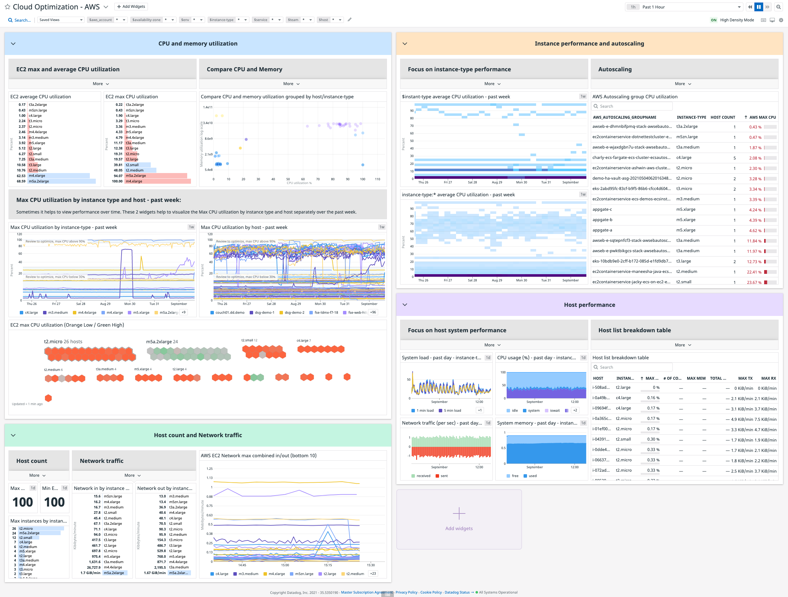

# Cloud Optimization - AWS

## Overview
This dashboard has been designed to help evaluate AWS EC2 usage for potential optimization.

### Use Cases
Optimizing EC2 usage can be a complex process of performance tests and a good understanding of how your instances are billed. This dashboard can be helpful to identify potential areas for improvement.

These widgets focus on CPU and memory utilization of EC2 instances. The metrics are grouped by the instance type, host, and autoscaling group. This allows for comparison of resource usage or what is not being used.

### Data Collection Requirements

- [Datadog Infrastructure](https://docs.datadoghq.com/infrastructure/)
  - [Datadog Agent](https://docs.datadoghq.com/agent/)
  - Cloud Provider Instances
    - [AWS](https://docs.datadoghq.com/integrations/amazon_web_services)
- Datadog Integrations
  - [AWS](https://docs.datadoghq.com/integrations/amazon_web_services/)
  - [Amazon EC2](https://docs.datadoghq.com/integrations/amazon_ec2/)

## Data Displayed

## List of Metrics and Tags
[AWS EC2 Metrics](https://docs.datadoghq.com/integrations/amazon_ec2/): Average percentage of allocated EC2 compute units that are currently in use on the instance.

[System Metrics](https://docs.datadoghq.com/integrations/system/#metrics): Metrics from your base system about the CPU, IO, load, memory, swap, and uptime.

### List of Template Variables

- aws_account
- availability-zone
- env
- instance-type
- service
- team
- host

### Preview

## Additional Information
This Dashboard has additional information in the description section as well as headers over most of the widgets. You may need to click into these to view all of the text.
