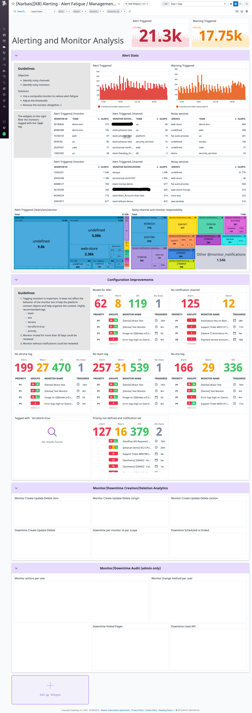

# Alerting and Alert Fatigue

This dashboard aims to optimize alerts and reduce alert fatigue that your teams
may suffer. It contains many guidelines and solutions:
- to optimize noisy chanels and monitors.
- to improve your configuration by adding tagging and owners to services.
- to use schedule downtimes for monitors.

Credits to [Nicolas Narbais](https://github.com/nxnarbais), who created the first version of this dashboard.

# How to use the dashboard

This dashboard gives you guidelines and solutions when dealing with alerting
and alert fatigue.

If you want to set up this dashboard, you can import the json file `alerting_and_alert_fatigue.json` enclosed.

## Template variables

With the __Alerting - Alert Fatigue__ dashboard template variables, you are able to filter your data by environments, team, service, and monitor id.

- `$env`, e.g. `dev`, `demo`, or `prod`.
- `$team`, allows you to filter by owners of services.
- `$service`, it's part of the [unified service tagging](https://docs.datadoghq.com/getting_started/tagging/unified_service_tagging/) (with `env`)
- `$monitor_id`, helps you to filter by monitor.

# Additional resources

- [Monitoring 101: Alerting on what matters](https://www.datadoghq.com/blog/monitoring-101-alerting/)
- [Reduce alert flapping Guide](https://docs.datadoghq.com/monitors/guide/reduce-alert-flapping/)
- [Blog post series related to AWS EC2 Key Metrics](https://www.datadoghq.com/blog/ec2-monitoring/)
- [Schedule downtimes for system shutdowns - Documentation](https://docs.datadoghq.com/monitors/notify/downtimes/?tabs=bymonitorname)

