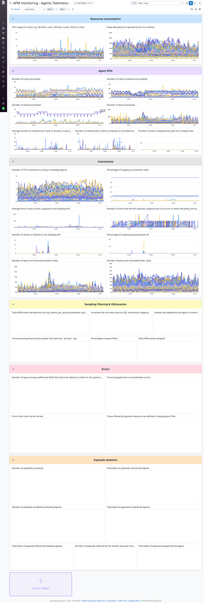

# APM Monitoring

This dashboard aims to give you information about how to monitor APM the useful
widgets you may need to use. This dashboard contains information related to:
- Resource consumption, e.g. CPU.
- Agent KPIs, e.g. number of traces, events, and spans.
- Connections, e.g. TCP, bytes sent, and number of retries on failures.
- Errors, e.g. errors or spans with malformed fields.
- Payload statistics.

Credits to [Pierre Guceski](https://github.com/l0k0ms), who created the first version of this dashboard.

# How to use the dashboard

This dashboard gives you guidelines and solutions when dealing with APM
monitoring.

If you want to set up this dashboard, you can import the json file `apm_monitoring.json` enclosed.

## Template variables

With the __APM Monitoring__ dashboard template variables, you are able to filter your data by host and environment.

- `$env`, e.g. `dev`, `demo`, or `prod`.
- `$host`, the specific host you want to look at.

# Additional resources

- [Knowledge center - Application Performance Management Overview](https://www.datadoghq.com/knowledge-center/application-performance-management/)
- [APM & Continuous Profiler documentation](https://docs.datadoghq.com/tracing/)
- [Blog post - Unify APM and RUM data for full-stack visibility](https://www.datadoghq.com/blog/unify-apm-rum-datadog/)

