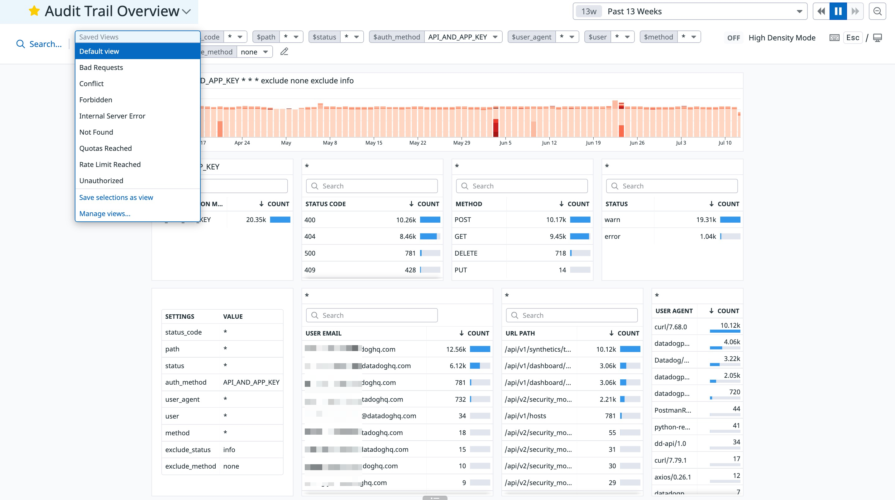

# Audit Trail Overview

Understand how your end-users use Datadog by leveraging Audit Trail.

# How to use the dashboard

Helps w/ understanding how end-users are using Datadog.

## Template variables

|variable                |description                                               |
|-----------------|----------------------------------------------------------------------------------|
|`$auth_method`   | filter all widgets to only include the specified authentication method (UI? API?)|
|`$exclude_method`| exclude selected HTTP method from all widgets to remove noise                    |
|`$exclude_status`| exclude selected status (info,error) from all widgets to remove noise            |
|`$method`        | filter all widgets to only include the specified HTTP method (GET/POST...)       |
|`$path`          | filter all widgets to only include the specified URL path                        |
|`$status`        | filter all widgets to only include the specified status                          |
|`$status_code`   | filter all widgets to only include the specified HTTP status code                |
|`$user`          | filter all widgets to only include the specified user                            |
|`$user_agent`    | filter all widgets to only include the specified HTTP user-agent                 |

# Additional resources

Comes w/ Saved Views
