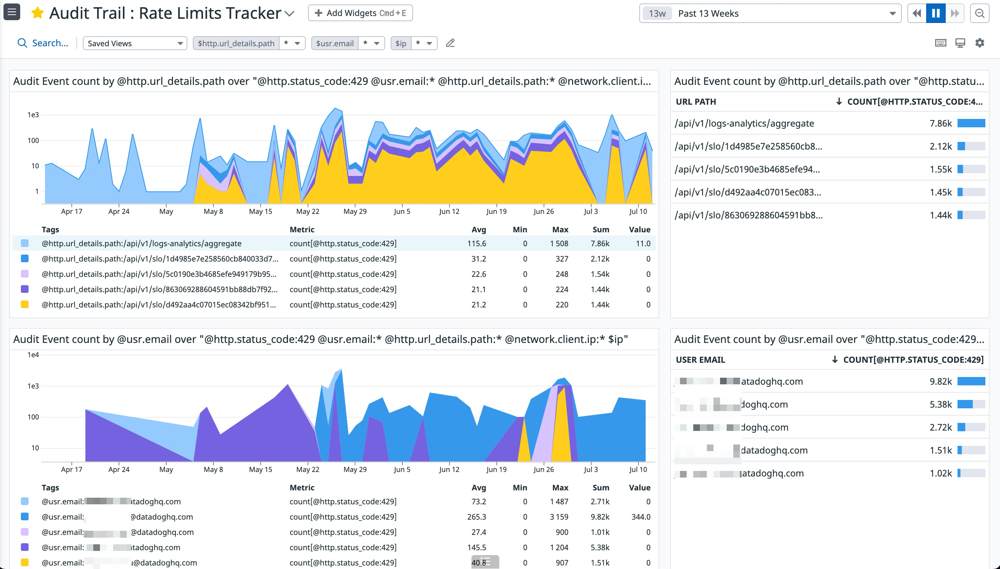
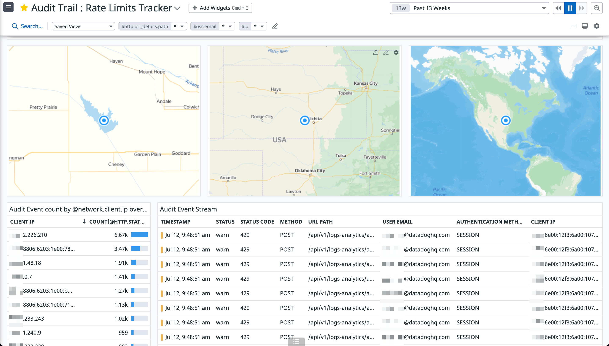

# Audit Trail : Rate Limits Tracker

Overview of Datadog rate limits being experienced by end-users

# How to use the dashboard

Helps w/ requesting API limits bumps by determining which exact endpoint.s end-users are experiencing throttling with.

## Template variables

|variable                |description                                               |
|------------------------|----------------------------------------------------------|
|`$http.url_details.path`|filter all widgets to only include the specified URL path |
|`$ip`                   |filter all widgets to only include the specified client.ip|
|`$usr.email`            |filter all widgets to only include the specified usr.email|

# Additional resources

Leverages external APIs for Geo2IP / custom PNG maps

- https://geomap-api.herokuapp.com
- yandex.ru
- https://ifconfig.co/
