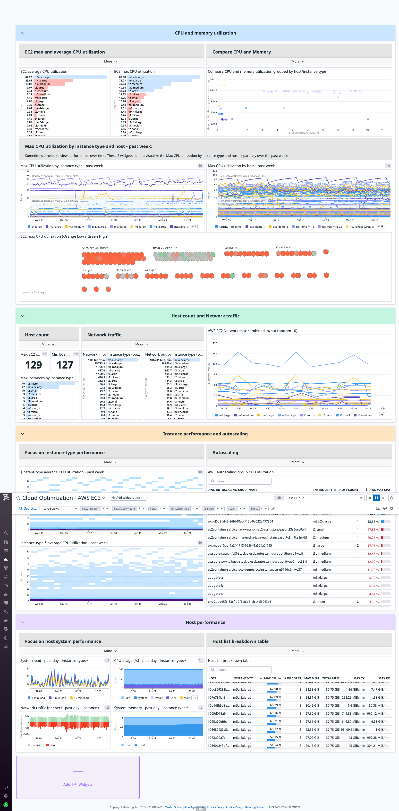

# Cloud Optimization - AWS EC2

This dashboard aims to give you a better visibility about the performances of your AWS
EC2. With such a dashboard, you'll be able to know:
- The CPU and memory utilization for your EC2s.
- The host count and the network traffic.
- The instance performances and their autoscaling.
- The host performance.

Credits to [Shawn Potts](https://github.com/spottsdd), who created the first version of this dashboard.

# How to use the dashboard

This dashboard will give you an overview of your EC2 performance, network, CPU
utilization, and traffic.

If you want to set up this dashboard, you can import the json file `datadog_cloud_optimization-ec2.json` enclosed.

## Template variables

With the __Datadog Cloud Optimization - AWS EC2__ dashboard template variables, you are able to select the usage coming only from an AWS account, availability zone, enviroment, instance type, service, team, and host.

- `$aws_account`, the account id.
- `availability-zone`, e.g. `us-east-1a` or `us-east-1b`
- `env`, e.g. `dev`, `demo`, or `prod`
- `instance-type`, e.g. `m5.xlarge` or `t1.micro`
- `service`, it's part of the [unified service tagging](https://docs.datadoghq.com/getting_started/tagging/unified_service_tagging/) (with `env`)
- `team`, tells you who own the instance.
- `host`, IP addresses and/or the instance id.

# Additional resources

- [AWS EC2 Integration](https://docs.datadoghq.com/integrations/amazon_ec2/)
- [Blog post series related to AWS EC2 Key Metrics](https://www.datadoghq.com/blog/ec2-monitoring/)
- [Top 5 AWS EC2 perfomances problems](https://www.datadoghq.com/pdf/Top-5-AWS-EC2-Performance-Problems.pdf)
