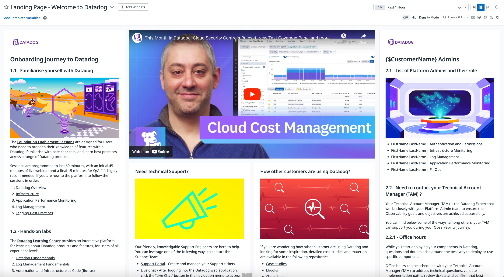

# Landing page - Welcome to Datadog

The Datadog organization landing page is the first page your users see when they log on to Datadog or navigate to the Datadog root page. Datadog sets a default landing page for your organization.
As an alternative to the default page, Datadog allows administrators to set a dashboard as the landing page for the organization.

The following custom landing page provides a guided experience for customers/teams who are onboarding in Datadog.

# How to use the dashboard

The dashboard contains all the relevant information for users who are new to the Datadog platform while addressting the following areas:
- Onboarding journey to Datadog
    - Foundation enablement sessions that cover the major pillars of observability; 
    - Hands-on labs for interactive learning; 
    - Datadog certification program;
    - Continuous support material;
- Need Technical Support?
    - How to reach out to the Support Engineering team;
    - Best practices when creating tickets; 
- How other customers are using Datadog?
    - Case studies, ebooks and cheetsheets; 
- Are there scripts and tools already available?
    - Datadog's Miscelany public repository; 

## Template variables

This dashboard is not making use of template variables.

# Additional resources

- [Custom Organization Landing Page](https://docs.datadoghq.com/account_management/org_settings/custom_landing/)
- [Foundation Enablement Sessions](https://www.datadoghq.com/technical-enablement/)
- [Datadog Learning Center](https://learn.datadoghq.com/)
- [Datadog Certification Program](https://www.datadoghq.com/certification/overview/)

