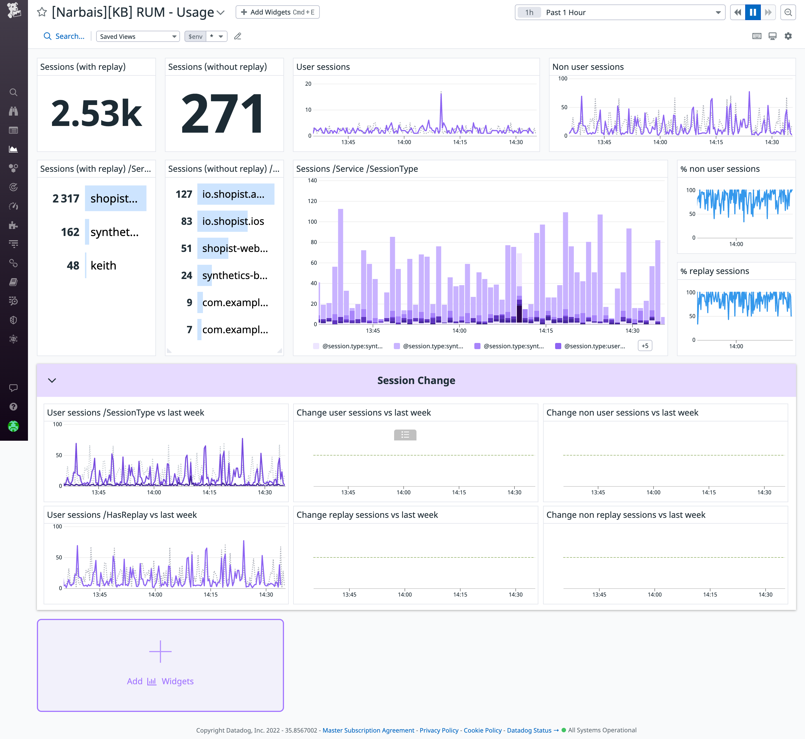

# RUM

With this dashboard, you'll be able to the volume of sessions per service and session type.
You'll also have the number of users versus non users sessions.

Credits to [Nicolas Narbais](https://github.com/nxnarbais), who created the first version of this dashboard.

# How to use the dashboard

This dashboard gives you informations about your RUM sessions for your users
and non users.

If you want to set up this dashboard, you can import the json file `rum.json` enclosed.

## Template variables

The __RUM__ dashboard contains only one template variable: `$env`. It allows
you to filter your dashboard data by environment, such as `dev`, `stagging`, or
`prod`.

# Additional resources

- [RUM Documentation](https://docs.datadoghq.com/real_user_monitoring/)
- [Introducing Datadog Real User Monitoring](https://www.datadoghq.com/blog/real-user-monitoring-with-datadog/)
- [Monitor Flutter application performance with Datadog Mobile RUM](https://www.datadoghq.com/blog/monitor-flutter-application-performance-with-mobile-rum/)

