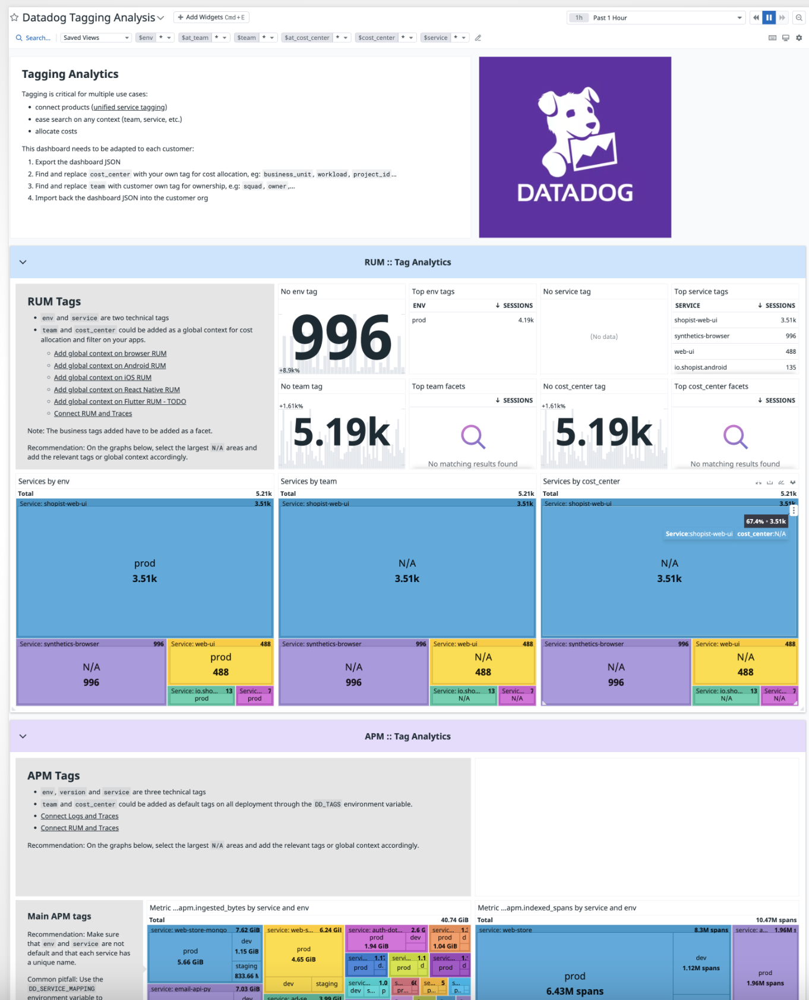

# Datadog Tagging Analytics

This dashboard provides a high level overview of the tag consistency in infrastructure, logs, application traces and Datadog resources such as Synthetics, RUM or Monitors. These are critical for multiple use cases: 
* connect different Datadog products to enhance correlation of metrics and events, 
* ease discoverability on any context or business related aggregation (`team`, `business_unit`, `owner`)
* allocate cost and attribute usage

Credits to [Nicolas Narbais](https://github.com/nxnarbais), who created the first version of this dashboard.

# How to use the dashboard

This dashboard will give you an overview of the tags analytics of your workload, per product. 

For more tagging information, read the official documentation on [Datadog Tagging](https://docs.datadoghq.com/getting_started/tagging/).

## Template variables

With the Datadog Tagging Analytics dashboard template variables you are able to select the usage coming only from one environment, service, team and/or cost center. 

* The `$env` and `service` variables correspond to the `env` and `service` tags, part of [unified service tagging](https://docs.datadoghq.com/getting_started/tagging/unified_service_tagging/).
* The `$team` and `$at_team` variables correspond to the `team` tag of the infra, logs, application traces and rum events. This is not a reserved tag, so you can change it to your own needs: `squad`, `owner`,...
* The `$cost_center` and `$at_cost_center` variables correspond to the `cost_center` tag of the infra, logs, application traces and rum events. Like `team` you can adapt it to your own usage: `business_unit`, `department` or `vertical`.

# Additional resources

* [Datadog Tagging](https://docs.datadoghq.com/getting_started/tagging/)
* [Best practices for tagging your infrastructure and applications](https://www.datadoghq.com/blog/tagging-best-practices/)
* [Usage attribution](https://docs.datadoghq.com/account_management/billing/usage_attribution/#overview)
