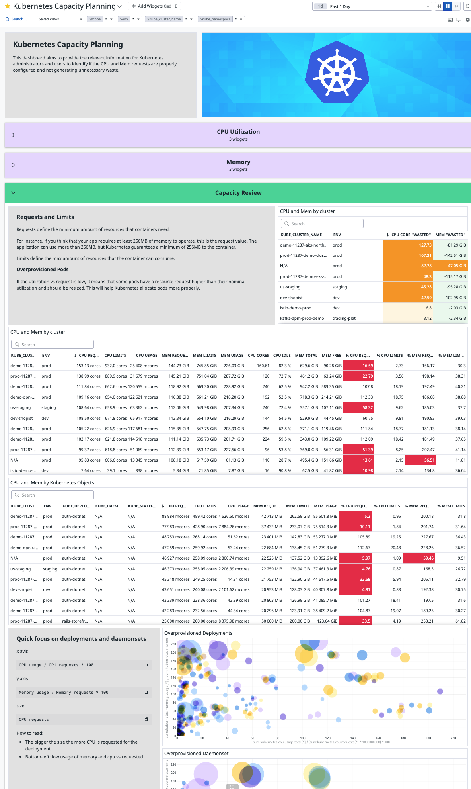

# Kubernetes Capacity Planning

The goal of this dashboard is to identify clusters with the biggest waste of resources related to kubernetes misconfiguration. The second objective is to then highlight the biggest offenders to drive change.

This dashboard highlights the biggest discrepancies between CPU and Mem utilization vs CPU and Mem requests.

# How to use the dashboard

Once one of the latest agents is deployed as well as the various Kubernetes integrations setup (mostly automated with the Helm/Operator deployment), the data will start populating the dashboard.

## Template variables

- env: to filter on any specific environment
- kube_cluster_name: to filter on a specific cluster
- kube_namespace: to filter on a specific namespace

# Additional resources

Blog post upcoming, check [our latest articles meanwhile](https://www.datadoghq.com/blog/).

# Going beyond

[Setup the Vertical Pod Autoscaler in recommendation mode](https://www.kubecost.com/kubernetes-autoscaling/kubernetes-vpa/) and include the recommendations in this dashboard to help any team identify the right CPU and Mem request to set.
